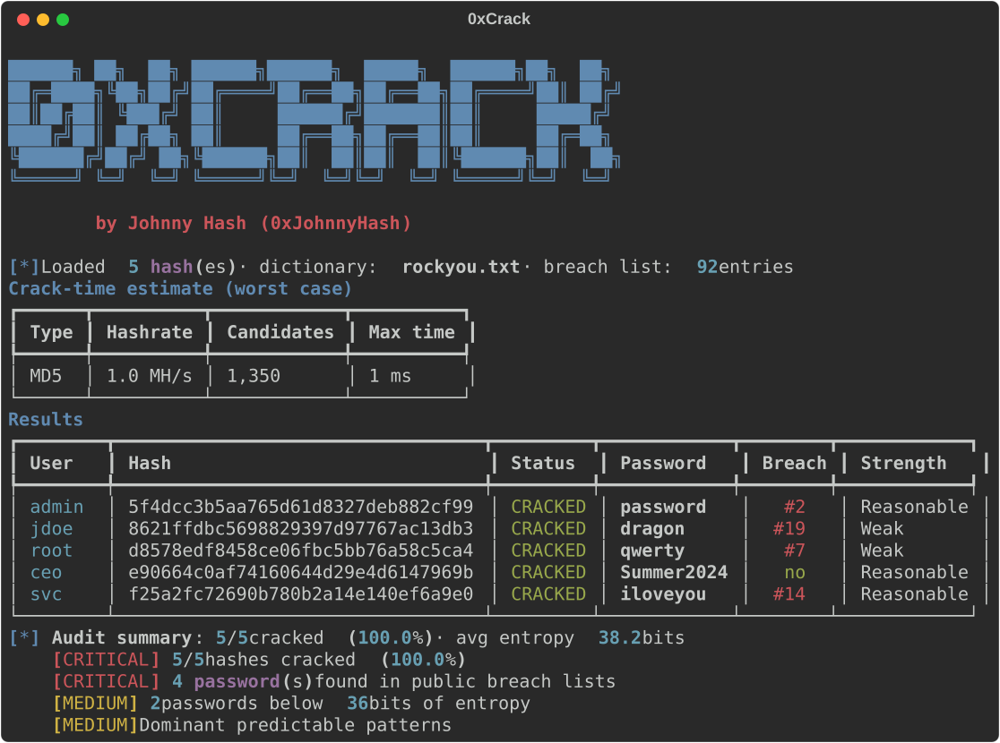

<div align="center">

# 🔓 0xCrack

**A smart, console-based password auditor — auto hash detection, live TUI, crack-time estimates, offline breach checks and rich audit reports.**

*Created by **Johnny Hash** (alias `0xJohnnyHash`)*




</div>

---

## ⚠️ Ethical-use notice

0xCrack is a **defensive/offensive security auditing tool** meant to run **offline**
against hashes you **legitimately own** and are **authorized** to test: internal
password audits, recovering your own credentials, CTFs and labs.

**Do not** use it against third-party systems or data without written permission.
Misusing password-cracking tools may be a crime. The author is not responsible for misuse.

---

## ✨ Why 0xCrack?

It doesn't try to out-muscle hashcat on raw GPU speed. Its edge is **workflow and
insight**: point it at a hash and it figures out the rest, then hands you an
actionable audit — not just a plaintext.

| Feature | 0xCrack |
|---|:---:|
| ⚡ **Auto mode** — detects hash type & picks the best strategy | ✅ |
| 🎨 Live terminal UI (animated bars, colors) via `rich` | ✅ |
| ⏱️ **Crack-time estimator** — benchmarks & predicts before attacking | ✅ |
| 🚨 **Offline breach check** — flags cracked passwords in top-leaked lists | ✅ |
| 🎓 **Explain mode** — narrates every decision (great for learning) | ✅ |
| 📊 **Audit report** — patterns, reuse, entropy, prioritized findings (HTML + JSON) | ✅ |
| Custom dictionaries (`-S`) | ✅ |
| No external engines needed (pure-Python core) | ✅ |

---

## 🚀 Install

```bash
git clone https://github.com/0xJohnnyHash/0xCrack.git
cd 0xCrack
pip install -r requirements.txt
```

Optionally install it as a real command:

```bash
pip install -e .
0xcrack --help
```

Otherwise just run the launcher:

```bash
python 0xcrack.py --help
```

---

## ⌨️ Usage

```bash
# Crack a file of hashes with your own dictionary + HTML report
python 0xcrack.py -T hashes.txt -S rockyou.txt -oG report.html

# A single hash, with the educational explain mode
python 0xcrack.py --hash 5f4dcc3b5aa765d61d8327deb882cf99 -S wordlist.txt --explain

# Force the hash type and export JSON
python 0xcrack.py -T dump.txt -S words.txt -m ntlm -oJ out.json

# Save the cracked passwords to a plain-text file (potfile style)
python 0xcrack.py -T hashes.txt -S rockyou.txt -oP cracked.txt
```

### Flags

| Flag | Meaning |
|---|---|
| `-T, --target FILE` | File with hashes to crack (one per line; `user:hash` supported) |
| `--hash HASH` | A single hash (instead of `-T`) |
| `-S, --source FILE` | **Dictionary / wordlist** source |
| `-m, --mode TYPE` | Force hash type (default: **auto-detect**) |
| `-oG FILE` | Write **HTML** audit report (passwords masked) |
| `-oJ FILE` | Write **JSON** audit report |
| `-oP FILE` | Write cracked passwords as **plain text** (potfile style: `[user:]hash:password`) |
| `--rules LIST` | Override mangling rules (`lower,capitalize,append_digits,leet,reverse`) |
| `--explain` | Educational mode: narrate every decision |
| `--no-estimate` | Skip the pre-attack crack-time estimate |
| `--no-banner` / `--no-color` | Quieter output |
| `--policy-min N` | Min length for the audited policy (default 12) |

Supported hash types: **MD5, SHA-1/224/256/384/512, NTLM, bcrypt, sha256crypt, sha512crypt**.

---

## 🧠 How Auto mode works

```
paste/-T hash ─▶ identify type ─▶ pick best strategy ─▶ use YOUR dictionary ─▶ attack ─▶ audit
```

- **Fast hash** (MD5/SHA/NTLM) → dictionary + rules `lower, capitalize, append_digits/year`.
- **Slow hash** (bcrypt, `$6$`) → dictionary with minimal rules (each guess is expensive).

You can always override the type with `-m` and the rules with `--rules`.

---

## 🌟 The differentiators

1. **⏱️ Crack-time estimator** — benchmarks the target algorithm on *your* machine,
   counts the candidate space (wordlist × rules) and prints the worst-case time
   *before* you commit to an attack.
2. **🚨 Offline breach check** — every recovered password is checked against a bundled
   most-leaked list (`data/common_passwords.txt`); hits are flagged with their rank and
   raised as a CRITICAL finding. Swap the file for the full SecLists top-N to go deeper.
3. **🎓 Explain mode** (`--explain`) — narrates the detected type, the chosen strategy and
   the reasoning, so the tool teaches while it works.
4. **📊 Audit report** — the original differentiator: length distribution, predictable
   patterns, password reuse, entropy and prioritized findings with remediation, exported
   as a self-contained HTML file and/or JSON.

---

## 🧩 Project layout

```
0xCrack/
├── 0xcrack.py                  # console launcher
├── oxcrack/
│   ├── banner.py               # blue ASCII-art banner
│   ├── cli.py                  # argparse + orchestration
│   ├── core/
│   │   ├── hashers.py          # algorithms + checkers
│   │   ├── engine.py           # dictionary / mask / brute engine
│   │   ├── hash_identifier.py  # hash-type detection
│   │   ├── strategy.py         # auto-mode recommender
│   │   ├── estimator.py        # ⏱️ crack-time estimator
│   │   ├── breach.py           # 🚨 offline breach check
│   │   └── audit.py            # analysis + findings
│   ├── report/html_report.py   # 📊 standalone HTML report
│   └── tui/live.py             # 🎨 rich live UI
├── data/common_passwords.txt   # bundled breach list
├── wordlists/sample.txt        # demo dictionary
└── tests/test_engine.py        # test suite
```

---

## 🧪 Tests

```bash
python tests/test_engine.py      # no extra deps
# or
python -m pytest -q
```

---

## 👤 Credits

Developed by **Johnny Hash** — *ethical hacker*, alias `0xJohnnyHash`.
Personal portfolio project focused on offensive & defensive security.

## 📄 License

MIT © 2026 **Johnny Hash** (`0xJohnnyHash`). See [LICENSE](LICENSE).
